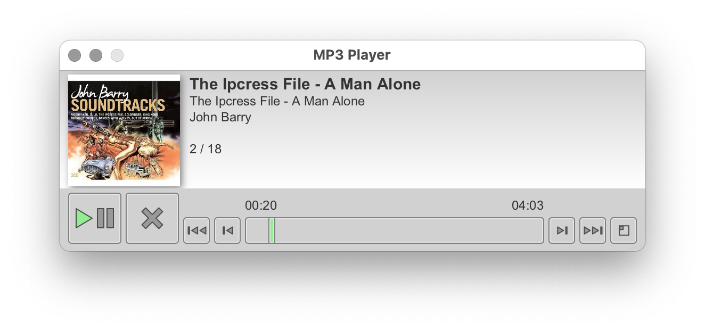
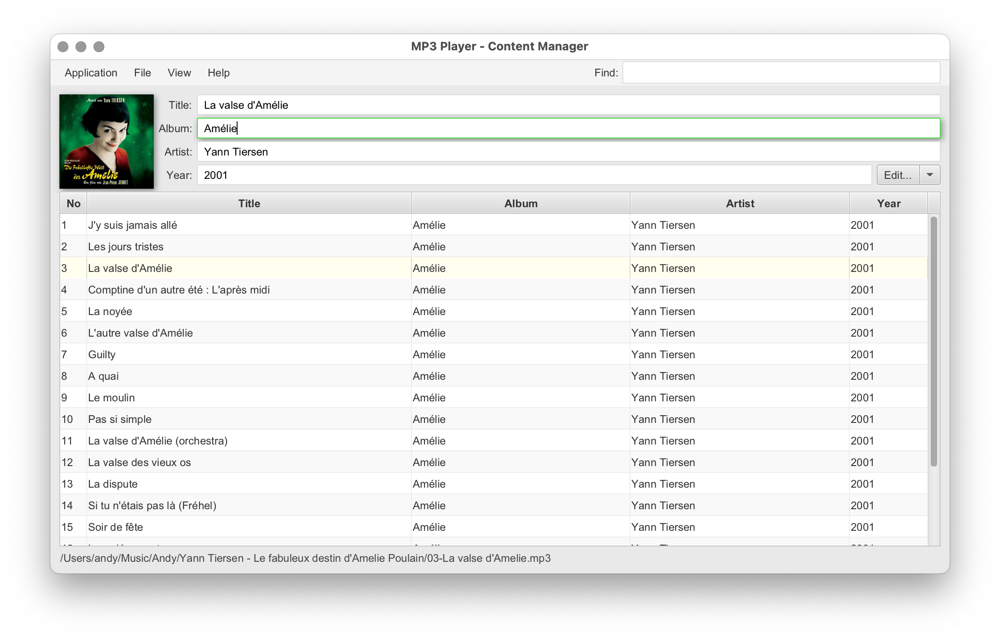

# MP3 Player

A simple MP3 player, a modern version of an older project.

(Work in progress).

## Why

It's got one function that no other MP3 player has - one-click jump to a random track.

## Software Requirements

Requires JDK 23+ with JavaFX 23+.

The easiest installation bundle might be [Azul JDK FX](https://www.azul.com/downloads/?version=java-23-lts&package=jdk-fx#zulu).

## License

This project and its source code is licensed under the [BSD 2-Clause "Simplified" License](LICENSE).
